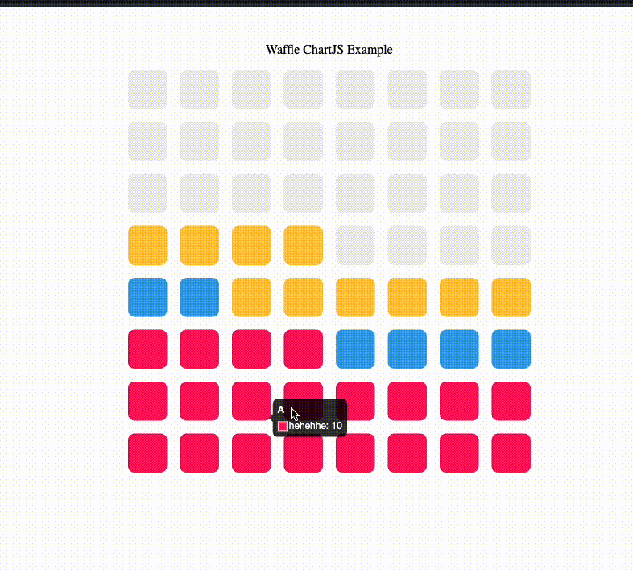

# chartjs-chart-waffle

Chart.js module for waffle charts.



## Install

```bash
npm install --save chart.js chartjs-chart-waffle

yarn add chart.js chartjs-chart-waffle
```

## Usage

### Data Structure

Sample (Vanilla Chart.js)

```js
const config = {
  type: "waffle",
  data: {
    labels: ["Apple", "Orange", "Banana"],
    datasets: [
      {
        data: [10, 3, 5],
        backgroundColor: [
          "rgba(255, 26, 104, 1)",
          "rgba(54, 162, 235, 1)",
          "rgba(255, 206, 86, 1)",
        ],
      },
    ],
  },
  options: {
    row: 8,
    column: 8,
    gap: 16,
    total: 50,
    fill: true,
    fillColor: "#eee",
    radius: 8,
  },
};
```

Sample (React)
[Example](./src/example.tsx)

### Options

| Name            | Type       | Default  | Description                                                          |
| --------------- | ---------- | -------- | -------------------------------------------------------------------- |
| labels          | `string[]` | Required | Labels. (Appears in tooltip)                                         |
| data            | `number[]` | Required | Data points                                                          |
| backgroundColor | `string[]` | Required | Color of active data points                                          |
| row             | `number`   | Required | Number of rows                                                       |
| column          | `number`   | Required | Number of columns                                                    |
| gap             | `number`   | 5        | Gap between blocks in px                                             |
| total           | `number`   | -        | Arbitrary total of the waffle data. Default: Sum of the `data` array |
| fill            | `boolean`  | false    | Fill placeholder blocks                                              |
| fillColor       | `string`   | #eee     | Color of placeholder blocks                                          |
| radius          | `number`   | 4        | Corner radius of a block                                             |

## Roadmap

- Chart.js v4 compatible
- Legends
- Better types
- Animation

## Credits

- Inspired by [@sgratzl](https://github.com/sgratzl) and his work within Chart.js ecosystem
